# Polyglot Codebase Knowledge Graph

> Generated offline by **readmenator**. 2 files, 20 symbols, 15 imports. Supports C, C++, Python, Go, Rust, JS/TS, Java, C#, Shell, PHP, Dart, GDScript, Nim, ASM, Ruby, Swift, Kotlin, Scala, Lua, Elixir.
> No LLMs. No tokens. Pure static analysis. See more [here](https://github.com/grisuno/ReadMenator)

**Start here:** Statistics Dashboard for scope, God Nodes for blast radius, Architecture Reference for per-file API. Agents: prefer `readmenator-agent/INDEX.md` + `SYMBOLS.md`.

**Wiki:** prefer `readmenator-wiki/index.md` for progressive disclosure: one synthesis page per community, `connections.json` with EXTRACTED vs INFERRED confidence, `queries.md` log, `REPORT.md` audit.

**Confidence:** EXTRACTED = parsed from source, INFERRED = heuristic bridge, AMBIGUOUS = reported, never hidden. See `readmenator-wiki/REPORT.md`.

**Total Files Parsed:** 2 | **Total Symbols Extracted:** 20 | **Total Imports:** 15

<!-- ranking_model: v1.0 | weights: {ppr:0.45,auth:0.2,test:0.15,doc:0.1,fresh:0.1} | alpha:0.85 | commit:1e0fd0b | date:2026-07-18 -->


## Table of Contents

1. [Statistics Dashboard](#statistics-dashboard)
2. [Architectural Layers](#architectural-layers)
3. [Ranked Context](#ranked-context)
4. [God Nodes](#god-nodes)
5. [Suggested Questions](#suggested-questions)
6. [Hotspot Analysis](#hotspot-analysis)
7. [Change Impact Analysis](#change-impact-analysis)
8. [Suggested Linting Rules](#suggested-linting-rules)
9. [Orphans](#orphans)
10. [Query Recipes](#query-recipes)
11. [Structural Knowledge Map](#structural-knowledge-map)
12. [UML Class Diagram](#uml-class-diagram)
13. [Code Property Graph](#code-property-graph)
14. [Architecture Reference](#architecture-reference)
    - [PY (1 files)](#py-1-files)
    - [SH (1 files)](#sh-1-files)

---

## Statistics Dashboard

| Metric | Value |
|--------|-------|
| Total Files | 2 |
| Total Symbols | 20 |
| Total Imports | 15 |
| Call Edges | 151 |
| Inheritance Edges | 6 |
| Languages | 2 |
| Avg Symbols/File | 10.0 |
| Avg Imports/File | 7.5 |

### Top Files by Import Count (Fan-Out)

| File | Imports | Symbols | Language |
|------|---------|---------|----------|
| `app.py` | 15 | 20 | py |

---

## Architectural Layers

Auto-detected from path patterns, naming conventions, and imported frameworks.

| Layer | Files |
|-------|-------|
| utility | 2 |

### utility

- `app.py` (py, 20 symbols)
- `install.sh` (sh, 0 symbols)

---

## Ranked Context

Files ranked by composite score for the current query context. The ranking combines Personalized PageRank (query relevance), global authority, test coverage, documentation coverage, and code freshness. Model: v1.0.

| Rank | File | Composite | PPR | Authority | Test | Doc |
|------|------|-----------|-----|-----------|------|-----|
| 1 | `app.py` | 0.0050 | 0.0000 | 0.0000 | 0.00 | 0.05 |
| 2 | `install.sh` | 0.0000 | 0.0000 | 0.0000 | 0.00 | 0.00 |

---

## God Nodes

Most architecturally central files ranked by combined import/export degree and symbol richness.

| File | Score | Connections | PageRank |
|------|-------|-------------|----------|
| `app.py` | 2.0 | | 0.0000 |
| `install.sh` | 0.0 | | 0.0000 |

---

## Suggested Questions

Auto-generated exploration prompts based on graph structure:

- What does app.py depend on, and what depends on it? (0 connections)
- What does install.sh depend on, and what depends on it? (0 connections)
- What is PTSymmetricActivation in app.py and how is it used?
- What is the overall architecture of this codebase?

---

## Hotspot Analysis

Files ranked by combined complexity (symbol count) and centrality (connection count). High-scoring files are architecturally critical and may need refactoring attention.

| File | Complexity | Centrality | Combined | Symbols | Connections |
|------|-----------|------------|----------|---------|-------------|
| `app.py` | 1.000 | 1.000 | 1.000 | 20 | 15 |
| `install.sh` | 0.000 | 0.000 | 0.000 | 0 | 0 |

---

## Change Impact Analysis

Files sorted by how many other files would be affected if they changed. High-impact files should be changed with caution.

| File | Direct Dependents | Transitive Dependents | Total Impact |
|------|------------------|----------------------|--------------|
| `app.py` | 0 | 0 | 0 |
| `install.sh` | 0 | 0 | 0 |

---

## Suggested Linting Rules

Automatically suggested linting and security rules based on patterns detected in the codebase. These can be exported as Semgrep rules using the `--export-rules` flag.

| Rule ID | Severity | Description | Language | Matches |
|---------|----------|-------------|----------|---------|
| `RM001` | info | Large number of functions in py: 14 total | py | 14 |
| `RM002` | info | Print statement found (consider logging instead) | python | 11 |

---

## Orphans

Files with no documentation or low connectivity. These are candidates for documentation investment or cleanup.

- `install.sh` (0 symbols, no doc)

---

## Query Recipes

Example queries you can run against this knowledge base using the ranking engine:

```
# Find files most relevant to a concept
readmenator query "Where is the import resolver implemented?"

# Rank files by relevance to a topic
readmenator query "How does documentation generation work?"

# Explain why a file ranks highly
readmenator query "explain readmenator/_documentation.py"

# Trace dependency paths with ranked context
readmenator query "path from CLI to exporter"
```

The ranking model uses the following signals:

- **Personalized PageRank** (45% weight): query-specific relevance via seed propagation
- **Global Authority** (20% weight): structural importance via standard PageRank
- **Test Coverage** (15% weight): fraction of symbols referenced in test files
- **Doc Coverage** (10% weight): presence of docstrings and file-level docs
- **Freshness** (10% weight): recent modification activity

Results include score decomposition and justification paths for each ranked item.

---

## Structural Knowledge Map

```mermaid
graph TD
    classDef mod fill:#1e1e1e,stroke:#ff6666,stroke-width:2px,color:#fff;
    classDef cls fill:#2d2d2d,stroke:#4ec9b0,stroke-width:2px,color:#fff;
    classDef fn fill:#333,stroke:#dcdcaa,stroke-width:1px,color:#dcdcaa;
    classDef ext fill:#111,stroke:#666,stroke-dasharray: 5 5,color:#aaa;
    app_py["app.py (py)"]
    class app_py mod;
    app_py_PTSymmetricActivation["PTSymmetricActivation"]
    class app_py_PTSymmetricActivation cls;
    app_py --> app_py_PTSymmetricActivation
    app_py_RicciCurvatureAttention["RicciCurvatureAttention"]
    class app_py_RicciCurvatureAttention cls;
    app_py --> app_py_RicciCurvatureAttention
    app_py_E8LatticeLayer["E8LatticeLayer"]
    class app_py_E8LatticeLayer cls;
    app_py --> app_py_E8LatticeLayer
    app_py_RESMAGraph["RESMAGraph"]
    class app_py_RESMAGraph cls;
    app_py --> app_py_RESMAGraph
    app_py_load_elliptic_data["load_elliptic_data"]
    class app_py_load_elliptic_data fn;
    app_py --> app_py_load_elliptic_data
    install_sh["install.sh (sh)"]
    class install_sh mod;
    ext_os["os"]
    class ext_os ext;
    app_py -.->|imports| ext_os
    ext_glob["glob"]
    class ext_glob ext;
    app_py -.->|imports| ext_glob
    ext_torch["torch"]
    class ext_torch ext;
    app_py -.->|imports| ext_torch
    ext_zipfile["zipfile"]
    class ext_zipfile ext;
    app_py -.->|imports| ext_zipfile
    ext_kagglehub["kagglehub"]
    class ext_kagglehub ext;
    app_py -.->|imports| ext_kagglehub
    ext_numpy["numpy"]
    class ext_numpy ext;
    app_py -.->|imports| ext_numpy
    ext_pandas["pandas"]
    class ext_pandas ext;
    app_py -.->|imports| ext_pandas
    ext_torch_nn["torch.nn"]
    class ext_torch_nn ext;
    app_py -.->|imports| ext_torch_nn
    ext_torch_nn_functional["torch.nn.functional"]
    class ext_torch_nn_functional ext;
    app_py -.->|imports| ext_torch_nn_functional
    ext_torch_geometric_data["torch_geometric.data"]
    class ext_torch_geometric_data ext;
    app_py -.->|imports| ext_torch_geometric_data
    ext_torch_geometric_nn["torch_geometric.nn"]
    class ext_torch_geometric_nn ext;
    app_py -.->|imports| ext_torch_geometric_nn
    ext_torch_geometric_utils["torch_geometric.utils"]
    class ext_torch_geometric_utils ext;
    app_py -.->|imports| ext_torch_geometric_utils
    ext_sklearn_preprocessing["sklearn.preprocessing"]
    class ext_sklearn_preprocessing ext;
    app_py -.->|imports| ext_sklearn_preprocessing
    ext_sklearn_model_selection["sklearn.model_selection"]
    class ext_sklearn_model_selection ext;
    app_py -.->|imports| ext_sklearn_model_selection
    ext_sklearn_metrics["sklearn.metrics"]
    class ext_sklearn_metrics ext;
    app_py -.->|imports| ext_sklearn_metrics
```



---

## UML Class Diagram

Auto-generated Mermaid class diagram from parsed class-level symbols. Shows classes, structs, interfaces, traits, and their methods with inheritance and dependency relationships.

```mermaid
classDiagram
  class app_py_PTSymmetricActivation {
    <<class>>
    +load_elliptic_data()
    +train_model(model, X, y, edge_index, name, epochs, lr)
    +__init__(self, omega, chi, kappa_init)
    +forward(self, x)
    +__init__(self, dim)
    +forward(self, x)
    +__init__(self, in_f, out_f, edge_index, num_nodes)
    +forward(self, x)
    +__init__(self, input_dim, hidden_dim, edge_index, num_nodes)
    +forward(self, x)
  }
  class app_py_RicciCurvatureAttention {
    <<class>>
    +load_elliptic_data()
    +train_model(model, X, y, edge_index, name, epochs, lr)
    +__init__(self, omega, chi, kappa_init)
    +forward(self, x)
    +__init__(self, dim)
    +forward(self, x)
    +__init__(self, in_f, out_f, edge_index, num_nodes)
    +forward(self, x)
    +__init__(self, input_dim, hidden_dim, edge_index, num_nodes)
    +forward(self, x)
  }
  class app_py_E8LatticeLayer {
    <<class>>
    +load_elliptic_data()
    +train_model(model, X, y, edge_index, name, epochs, lr)
    +__init__(self, omega, chi, kappa_init)
    +forward(self, x)
    +__init__(self, dim)
    +forward(self, x)
    +__init__(self, in_f, out_f, edge_index, num_nodes)
    +forward(self, x)
    +__init__(self, input_dim, hidden_dim, edge_index, num_nodes)
    +forward(self, x)
  }
  class app_py_RESMAGraph {
    <<class>>
    +load_elliptic_data()
    +train_model(model, X, y, edge_index, name, epochs, lr)
    +__init__(self, omega, chi, kappa_init)
    +forward(self, x)
    +__init__(self, dim)
    +forward(self, x)
    +__init__(self, in_f, out_f, edge_index, num_nodes)
    +forward(self, x)
    +__init__(self, input_dim, hidden_dim, edge_index, num_nodes)
    +forward(self, x)
  }
  class app_py_MLP {
    <<class>>
    +load_elliptic_data()
    +train_model(model, X, y, edge_index, name, epochs, lr)
    +__init__(self, omega, chi, kappa_init)
    +forward(self, x)
    +__init__(self, dim)
    +forward(self, x)
    +__init__(self, in_f, out_f, edge_index, num_nodes)
    +forward(self, x)
    +__init__(self, input_dim, hidden_dim, edge_index, num_nodes)
    +forward(self, x)
  }
  class app_py_SimpleGCN {
    <<class>>
    +load_elliptic_data()
    +train_model(model, X, y, edge_index, name, epochs, lr)
    +__init__(self, omega, chi, kappa_init)
    +forward(self, x)
    +__init__(self, dim)
    +forward(self, x)
    +__init__(self, in_f, out_f, edge_index, num_nodes)
    +forward(self, x)
    +__init__(self, input_dim, hidden_dim, edge_index, num_nodes)
    +forward(self, x)
  }
```



---

## Code Property Graph

Machine-readable Code Property Graph (CPG) in JSON-LD format. This block allows AI agents to parse the full structural graph without additional file reads. Compatible with GraphRAG pipelines.

```json
{"@context": "https://schema.org", "analysis": {"communities": [], "god_nodes": [{"node_id": "app.py", "score": 2.0}, {"node_id": "install.sh", "score": 0.0}], "surprising_connections": []}, "edges": [{"confidence": "EXTRACTED", "relation": "imports", "source": "app.py", "target": "os"}, {"confidence": "EXTRACTED", "relation": "imports", "source": "app.py", "target": "glob"}, {"confidence": "EXTRACTED", "relation": "imports", "source": "app.py", "target": "torch"}, {"confidence": "EXTRACTED", "relation": "imports", "source": "app.py", "target": "zipfile"}, {"confidence": "EXTRACTED", "relation": "imports", "source": "app.py", "target": "kagglehub"}, {"confidence": "EXTRACTED", "relation": "imports", "source": "app.py", "target": "numpy"}, {"confidence": "EXTRACTED", "relation": "imports", "source": "app.py", "target": "pandas"}, {"confidence": "EXTRACTED", "relation": "imports", "source": "app.py", "target": "torch.nn"}, {"confidence": "EXTRACTED", "relation": "imports", "source": "app.py", "target": "torch.nn.functional"}, {"confidence": "EXTRACTED", "relation": "imports", "source": "app.py", "target": "torch_geometric.data"}, {"confidence": "EXTRACTED", "relation": "imports", "source": "app.py", "target": "torch_geometric.nn"}, {"confidence": "EXTRACTED", "relation": "imports", "source": "app.py", "target": "torch_geometric.utils"}, {"confidence": "EXTRACTED", "relation": "imports", "source": "app.py", "target": "sklearn.preprocessing"}, {"confidence": "EXTRACTED", "relation": "imports", "source": "app.py", "target": "sklearn.model_selection"}, {"confidence": "EXTRACTED", "relation": "imports", "source": "app.py", "target": "sklearn.metrics"}], "generator": "readmenator", "metadata": {"edge_count": 172, "file_count": 2, "language_count": 2, "symbol_count": 20}, "nodes": [{"doc": "app.py  Autor: Gris Iscomeback Correo electrónico: grisiscomeback[at]gmail[dot]com Fecha de creación: 24/12/2025 Licencia: GPL v3  Descripción: Regalo de Navidad.", "id": "app.py", "kind": "module", "label": "app.py", "language": "py", "sha256": "a8b09f59b4ed60eb", "symbol_count": 20, "symbols": [{"kind": "class", "line": 31, "name": "PTSymmetricActivation", "signature": "class PTSymmetricActivation(Module)"}, {"kind": "class", "line": 44, "name": "RicciCurvatureAttention", "signature": "class RicciCurvatureAttention(Module)"}, {"kind": "class", "line": 59, "name": "E8LatticeLayer", "signature": "class E8LatticeLayer(Module)"}, {"kind": "class", "line": 76, "name": "RESMAGraph", "signature": "class RESMAGraph(Module)"}, {"kind": "method", "line": 97, "name": "load_elliptic_data", "signature": "def load_elliptic_data()"}, {"kind": "class", "line": 157, "name": "MLP", "signature": "class MLP(Module)"}, {"kind": "class", "line": 175, "name": "SimpleGCN", "signature": "class SimpleGCN(Module)"}, {"kind": "method", "line": 188, "name": "train_model", "signature": "def train_model(model, X, y, edge_index, name, epochs, lr)"}, {"kind": "method", "line": 32, "name": "__init__", "signature": "def __init__(self, omega, chi, kappa_init)"}, {"kind": "method", "line": 37, "name": "forward", "signature": "def forward(self, x)"}, {"kind": "method", "line": 45, "name": "__init__", "signature": "def __init__(self, dim)"}, {"kind": "method", "line": 51, "name": "forward", "signature": "def forward(self, x)"}, {"kind": "method", "line": 60, "name": "__init__", "signature": "def __init__(self, in_f, out_f, edge_index, num_nodes)"}, {"kind": "method", "line": 70, "name": "forward", "signature": "def forward(self, x)"}, {"kind": "method", "line": 77, "name": "__init__", "signature": "def __init__(self, input_dim, hidden_dim, edge_index, num_nodes)"}, {"kind": "method", "line": 86, "name": "forward", "signature": "def forward(self, x)"}, {"kind": "method", "line": 158, "name": "__init__", "signature": "def __init__(self, input_dim, hidden_dim)"}, {"kind": "method", "line": 172, "name": "forward", "signature": "def forward(self, x)"}, {"kind": "method", "line": 177, "name": "__init__", "signature": "def __init__(self, input_dim, hidden_dim)"}, {"kind": "method", "line": 182, "name": "forward", "signature": "def forward(self, x, edge_index)"}]}, {"id": "install.sh", "kind": "module", "label": "install.sh", "language": "sh", "sha256": "c907d80fd6734993", "symbol_count": 0, "symbols": []}], "type": "CodePropertyGraph", "version": "1.0"}
```

---

## Architecture Reference

### PY (1 files)

#### `app.py`
**Path:** `app.py`
**File Doc:** *app.py  Autor: Gris Iscomeback Correo electrónico: grisiscomeback[at]gmail[dot]com Fecha de creación: 24/12/2025 Licencia: GPL v3  Descripción: Regalo de Navidad.*

**Classes:**
- `PTSymmetricActivation` (line 31) `class PTSymmetricActivation(Module)`
- `RicciCurvatureAttention` (line 44) `class RicciCurvatureAttention(Module)`
- `E8LatticeLayer` (line 59) `class E8LatticeLayer(Module)`
- `RESMAGraph` (line 76) `class RESMAGraph(Module)`
- `MLP` (line 157) `class MLP(Module)`
- `SimpleGCN` (line 175) `class SimpleGCN(Module)`

**Methods:**
- `load_elliptic_data` (line 97) `def load_elliptic_data()`
- `train_model` (line 188) `def train_model(model, X, y, edge_index, name, epochs, lr)`
- `__init__` (line 32) `def __init__(self, omega, chi, kappa_init)`
- `forward` (line 37) `def forward(self, x)`
- `__init__` (line 45) `def __init__(self, dim)`
- `forward` (line 51) `def forward(self, x)`
- `__init__` (line 60) `def __init__(self, in_f, out_f, edge_index, num_nodes)`
- `forward` (line 70) `def forward(self, x)`
- `__init__` (line 77) `def __init__(self, input_dim, hidden_dim, edge_index, num_nodes)`
- `forward` (line 86) `def forward(self, x)`
- `__init__` (line 158) `def __init__(self, input_dim, hidden_dim)`
- `forward` (line 172) `def forward(self, x)`
- `__init__` (line 177) `def __init__(self, input_dim, hidden_dim)`
- `forward` (line 182) `def forward(self, x, edge_index)`

### SH (1 files)

#### `install.sh`
**Path:** `install.sh`

*No symbols extracted*
