# Polyglot Codebase Knowledge Graph

> Generated offline by **readmenator**. Supports C, C++, Python, Go, Rust, JS/TS, Java, C#, Shell, PHP, Dart, GDScript, Nim, ASM.
> No LLMs. No tokens. Pure static analysis.

**Total Files Parsed:** 2 | **Total Symbols Extracted:** 20 | **Total Imports:** 15

## Structural Knowledge Map

```mermaid
graph TD
    classDef mod fill:#1e1e1e,stroke:#ff6666,stroke-width:2px,color:#fff;
    classDef cls fill:#2d2d2d,stroke:#4ec9b0,stroke-width:2px,color:#fff;
    classDef fn fill:#333,stroke:#dcdcaa,stroke-width:1px,color:#dcdcaa;
    classDef ext fill:#111,stroke:#666,stroke-dasharray: 5 5,color:#aaa;
    app_py["app.py (py)"]
    class app_py mod;
    app_py_PTSymmetricActivation["PTSymmetricActivation"]
    class app_py_PTSymmetricActivation cls;
    app_py --> app_py_PTSymmetricActivation
    app_py_RicciCurvatureAttention["RicciCurvatureAttention"]
    class app_py_RicciCurvatureAttention cls;
    app_py --> app_py_RicciCurvatureAttention
    app_py_E8LatticeLayer["E8LatticeLayer"]
    class app_py_E8LatticeLayer cls;
    app_py --> app_py_E8LatticeLayer
    app_py_RESMAGraph["RESMAGraph"]
    class app_py_RESMAGraph cls;
    app_py --> app_py_RESMAGraph
    app_py_load_elliptic_data["load_elliptic_data"]
    class app_py_load_elliptic_data fn;
    app_py --> app_py_load_elliptic_data
    install_sh["install.sh (sh)"]
    class install_sh mod;
    ext_os["os"]
    class ext_os ext;
    app_py -.->|imports| ext_os
    ext_glob["glob"]
    class ext_glob ext;
    app_py -.->|imports| ext_glob
    ext_torch["torch"]
    class ext_torch ext;
    app_py -.->|imports| ext_torch
    ext_zipfile["zipfile"]
    class ext_zipfile ext;
    app_py -.->|imports| ext_zipfile
    ext_kagglehub["kagglehub"]
    class ext_kagglehub ext;
    app_py -.->|imports| ext_kagglehub
    ext_numpy["numpy"]
    class ext_numpy ext;
    app_py -.->|imports| ext_numpy
    ext_pandas["pandas"]
    class ext_pandas ext;
    app_py -.->|imports| ext_pandas
    ext_torch_nn["torch.nn"]
    class ext_torch_nn ext;
    app_py -.->|imports| ext_torch_nn
    ext_torch_nn_functional["torch.nn.functional"]
    class ext_torch_nn_functional ext;
    app_py -.->|imports| ext_torch_nn_functional
    ext_torch_geometric_data["torch_geometric.data"]
    class ext_torch_geometric_data ext;
    app_py -.->|imports| ext_torch_geometric_data
    ext_torch_geometric_nn["torch_geometric.nn"]
    class ext_torch_geometric_nn ext;
    app_py -.->|imports| ext_torch_geometric_nn
    ext_torch_geometric_utils["torch_geometric.utils"]
    class ext_torch_geometric_utils ext;
    app_py -.->|imports| ext_torch_geometric_utils
    ext_sklearn_preprocessing["sklearn.preprocessing"]
    class ext_sklearn_preprocessing ext;
    app_py -.->|imports| ext_sklearn_preprocessing
    ext_sklearn_model_selection["sklearn.model_selection"]
    class ext_sklearn_model_selection ext;
    app_py -.->|imports| ext_sklearn_model_selection
    ext_sklearn_metrics["sklearn.metrics"]
    class ext_sklearn_metrics ext;
    app_py -.->|imports| ext_sklearn_metrics
```

---

## Architecture Reference

### PY (1 files)

#### `app.py`
**Path:** `app.py`

**Classs:**
- `PTSymmetricActivation` (line 31)
- `RicciCurvatureAttention` (line 44)
- `E8LatticeLayer` (line 59)
- `RESMAGraph` (line 76)
- `MLP` (line 157)
- `SimpleGCN` (line 175)

**Functions:**
- `load_elliptic_data` (line 97)
- `train_model` (line 188)
- `__init__` (line 32)
- `forward` (line 37)
- `__init__` (line 45)
- `forward` (line 51)
- `__init__` (line 60)
- `forward` (line 70)
- `__init__` (line 77)
- `forward` (line 86)
- `__init__` (line 158)
- `forward` (line 172)
- `__init__` (line 177)
- `forward` (line 182)

### SH (1 files)

#### `install.sh`
**Path:** `install.sh`

*No symbols extracted*
